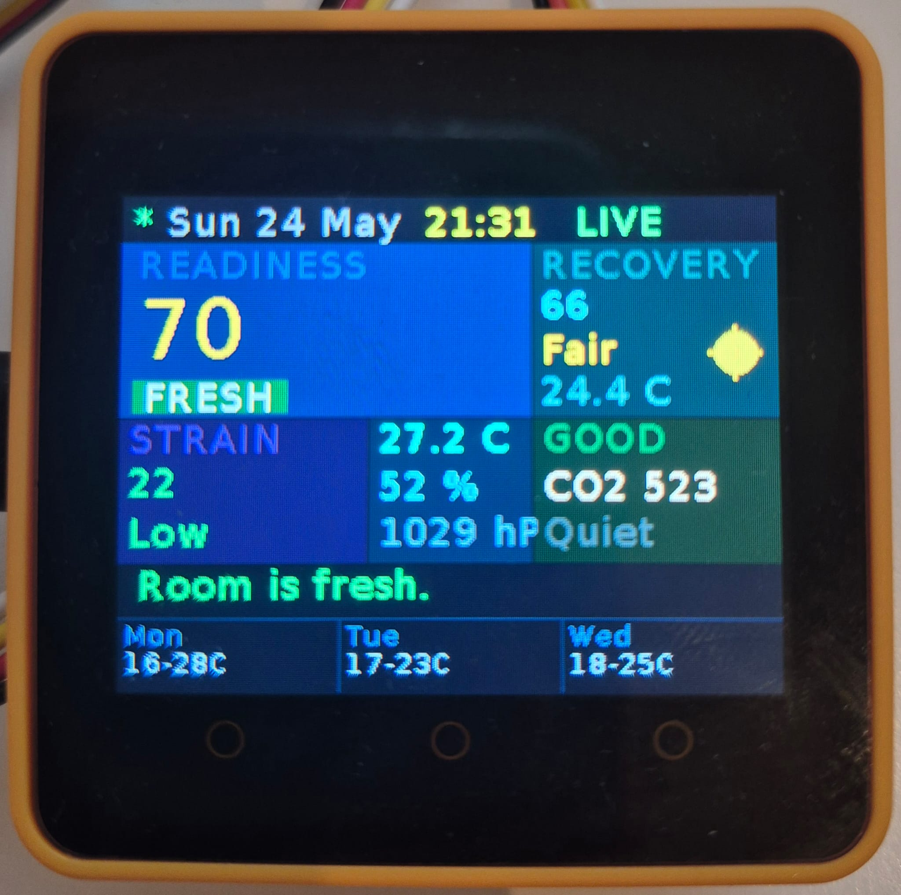
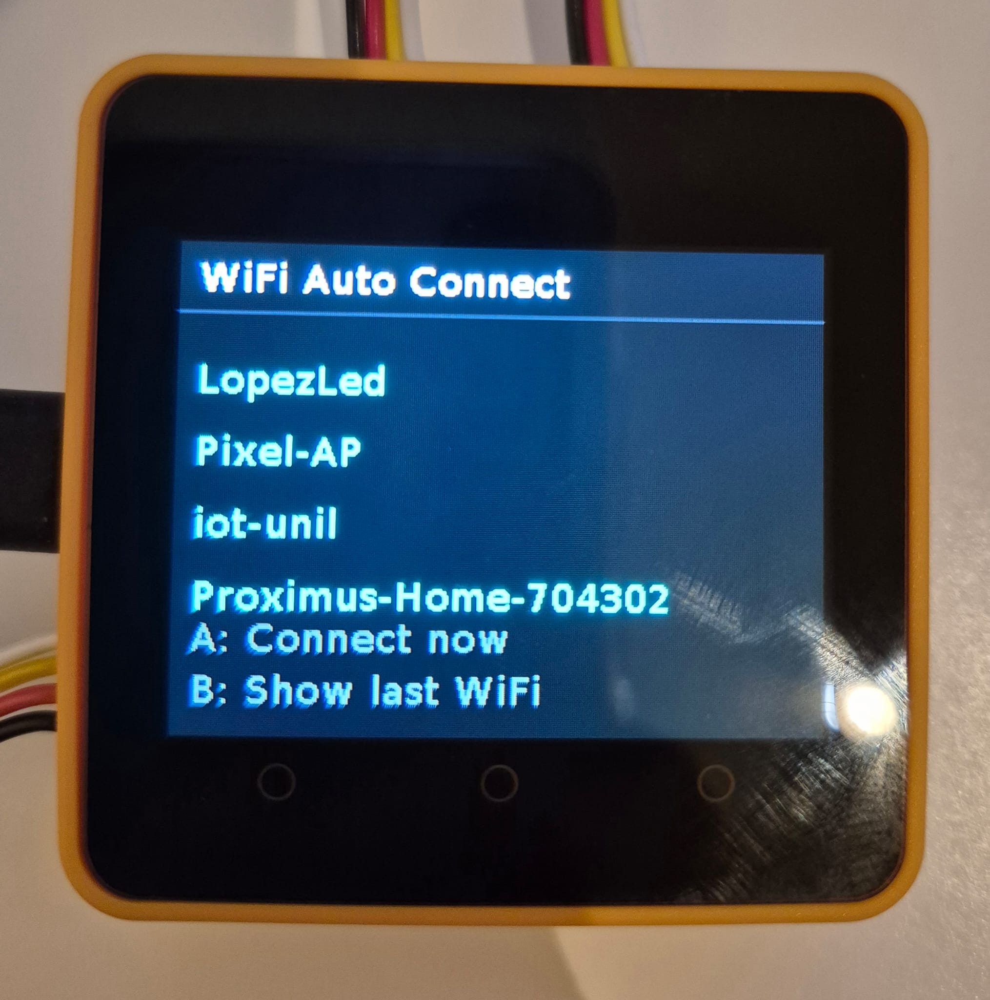

# AmbientClimateCompanion — WHOOP for Room

A room-performance system that continuously senses how supportive a space is for focus, calm, comfort, and recovery.

We treat the room like a living environment with performance states. Rather than displaying raw sensor values, the system derives four human-readable metrics that describe how the room *feels* right now.

> These metrics do not claim to measure human biology directly. They are environmental interpretation metrics based on indoor climate, air quality, occupancy, and weather context, designed to describe how supportive the space may feel for comfort, focus, calm, and recovery.

---

## Live deployment

| Service | URL |
|---------|-----|
| **Dashboard** | https://ambient-dashboard-977755576323.europe-west6.run.app |
| **Backend API** | https://ambient-climate-backend-977755576323.europe-west6.run.app/api/v1 |
| **Health check** | https://ambient-climate-backend-977755576323.europe-west6.run.app/api/v1/health |

---

## Core Metrics

### 1. Room Readiness
Measures how supportive the room is for being present, focused, comfortable, and productive right now.

*"How ready is the room for work, study, or normal daytime use?"*

**Factors:** indoor temperature, humidity, TVOC/eCO2, recent occupancy strain  
**High** → room feels supportive and usable · **Low** → space feels less supportive or mildly stressful

---

### 2. Recovery Score
Measures how supportive the room is for calm, rest, decompression, and recovery-like conditions.

*"How good is this room for calming down, resting, or recovery?"*

**Factors:** milder temperature (18–22 C), non-dry humidity, lower TVOC, low recent strain  
**High** → restful and recovery-friendly · **Low** → room feels less restorative

---

### 3. Air Strain
Measures how stressed or burdened the room feels due to poor air conditions and environmental buildup.

*"How heavy or strained does the air feel right now?"*

**Factors:** TVOC, eCO2, heat combined with poor air, recent occupancy/motion  
**Low** → fresh / easy air · **High** → heavy, stale, strained environment

---

### 4. Room State
The room's current human-readable identity — a short label that summarises how the room feels at a glance.

*"What kind of room am I in right now?"*

| Label | Meaning |
|-------|---------|
| `Fresh` | Air feels light, usable, and supportive |
| `Calm` | Room feels stable, balanced, and quiet |
| `Dry` | Humidity is too low, comfort is reduced |
| `Heavy` | Air feels stale, burdened, or environmentally strained |
| `Social` | Recent motion/presence — room is active and in use |
| `Sleep-Friendly` | Room feels more suitable for evening calm or rest |
| `Restless` | Conditions are unbalanced but not yet Heavy |

---

## What has been built

### Device — M5Stack sensor (`device/`)
- M5Stack project (`main_project.m5f`) running UIFlow1 / MicroPython on M5Stack Core2
- Reads sensors every 60 s; sends telemetry to the backend every 5 minutes
- Captures: temperature, humidity, air quality (TVOC ppb), eCO2, atmospheric pressure, motion, Wi-Fi RSSI
- Fetches live outdoor weather and 3-day forecast from OpenWeatherMap directly on-device
- Authenticates with the backend using a shared device token (`Authorization: Bearer`)
- Sends structured event logs to the backend `/events` endpoint (boot, WiFi, cloud sync, alerts)

**Boot sequence**

1. Load flash state cache (`/flash/last_state.json`) — dashboard shows last known values instantly
2. Connect Wi-Fi — tries a priority-ordered list of networks (last successful network first)
3. Sync NTP — sets RTC with configurable timezone offset (`TZ_OFFSET = 2`)
4. Cloud sync — fetches `/latest` from backend; applies cloud data only if it is fresher than the local cache
5. Fetch outdoor weather + 3-day forecast from OpenWeatherMap
6. Enter main loop

**Offline resilience**

- Flash cache persists all sensor values, outdoor weather, and data source across reboots
- Silent WiFi reconnect every 60 s in the background without touching the screen
- Failed sensor reads preserve the last known value (non-destructive inner `except: pass`)
- State machine tracks `network_state`, `telemetry_state`, `weather_state`, `cloud_sync_state`

**Dashboard UI (320 × 240, dark background)**

```
┌────────────────────────────────────────┐
│  ● Thu 17 Apr   LIVE            14:32  │  header: dot, date, badge, time
├────────────────────────────────────────┤
│     23.4 °C          Sync failed       │  hero: outdoor temp, status strip
│  Partly cloudy               HUM 62%  │
├────────────────────────────────────────┤
│  TEMP    │   HUMID   │   PRESS         │  indoor strip
│  21.1°C  │   58 %    │   1013 hPa     │
├────────────────────────────────────────┤
│  [ GOOD ]   45 ppb         eCO2 412   │  AQ strip
├────────────────────────────────────────┤
│  Mon       │  Tue      │  Wed          │  3-day forecast
│  16/23°C   │  14/20°C  │  15/22°C     │
│  Clouds    │  Rain     │  Clear        │
└────────────────────────────────────────┘
```

- **Source badge** (header): `LIVE` / `CLOUD` / `CACHED` / `OFFLINE` / `SEND FAIL` / `WX OLD` — color-coded by severity
- **Status strip** (hero row, right side): priority-ordered room-state message — `Offline` › `Sync failed` › `Air strain` › `Dry air` › `Restless` › `Room synced` (15 s) › `Motion` (8 s) › `Weather fresh` (30 s) › `Fresh` / `Calm` / `Sleep-Friendly` / `Social`

**Alerts (sent as events to backend)**

- Humidity drops below 40 % → `humidity_alert` event (edge-triggered, resets when condition clears)
- TVOC ≥ 150 ppb → `air_quality_alert` event (edge-triggered)
- Motion detected → `motion_triggered` event (8 s cooldown before re-trigger)

**Hardware wiring (M5Stack Core2)**

| Sensor | Unit | Port |
|--------|------|------|
| ENV III (temp / humidity / pressure) | `unit.ENV3` | PORTC |
| PIR motion sensor | `unit.PIR` | PORTB |
| TVOC / eCO2 sensor | `unit.TVOC` | PORTA |

**Buttons**

| Button | Action |
|--------|--------|
| **A** | Page 1 — Dashboard (sensor tiles, readiness / recovery / strain) |
| **B** | Page 2 — Coach status (action recommendation, score chips) |
| **C** | Coach menu — Ask / Box Breathing / Meditation (see *Voice + Coach* below) |

**Device screenshots**

| Dashboard | WiFi menu |
|-----------|-----------|
|  |  |

### Backend — Flask REST API (`backend/`)
Python 3.11 / Flask application containerised with Docker, designed to run on Google Cloud Run.

**API endpoints**

| Method | Path | Description |
|--------|------|-------------|
| `POST` | `/telemetry` | Receive sensor payload from M5Stack, enrich with outdoor weather, insert into BigQuery |
| `GET` | `/latest?device_id=` | Return the most recent record for a device |
| `GET` | `/history?device_id=&hours=` | Return records for the last N hours (default 24, max 168) |
| `POST` | `/events` | Receive structured device event logs (boot, WiFi, alerts, sync) |
| `GET` | `/weather` | Return current outdoor weather from OpenWeatherMap |
| `GET` | `/health` | Liveness check used by Cloud Run |
| `POST` | `/speech/stt` | Whisper transcription — accepts base64 WAV, returns transcript |
| `POST` | `/speech/tts` | OpenAI TTS — `?profile=m5stack` re-encodes to 16 kHz / 16-bit / mono so `speaker.playWAV` accepts it |
| `POST` | `/speech/ask` | Voice question → gpt-4o-mini agent (intent classifier + answer in one structured-output call) with current + 24 h indoor + yesterday outdoor + 3-day forecast snapshot → WHOOP-style one-line answer + queued TTS audio |
| `GET` | `/speech/proactive` | Drains pending audio queue, otherwise evaluates the trigger catalog (see *Proactive announcements* below) |
| `GET` | `/speech/meditation` | Returns a meditation session config (title, duration, breath cadence, timed prompts) |
| `GET` | `/speech/meditation/sessions` | Catalog of available meditation session ids |

**Services**
- `telemetry_service` — normalises the device payload, derives `air_quality_label` (Good / Moderate / Poor / Hazardous), fetches outdoor weather, and writes the enriched record to BigQuery
- `bigquery_service` — streaming inserts and parameterised queries against the `weather_records` table
- `weather_service` — fetches current outdoor weather from OpenWeatherMap and maps it into `outdoor_temp`, `outdoor_humidity`, `outdoor_weather`, `outdoor_icon`, `weather_status`
- `auth_service` — validates the shared device token on ingest requests
- `stt_service` / `tts_service` — Whisper transcription and OpenAI TTS for voice I/O
- `agent_service` — single source of truth for `/speech/ask`. Builds a JSON snapshot of `current` readings, `last_24h` indoor aggregates, `outdoor_yesterday` aggregates (modal weather + min/max temp/humidity from BigQuery), and the 3-day `forecast`. Sends it to `gpt-4o-mini` along with the intent catalog and forces a structured `{intent, answer}` response via OpenAI's `json_schema` response format. On timeout / API error / parse failure / missing key, falls back to a generic deflection tagged `unknown` so the device never stalls
- `agent_intents` — loads and validates `app/data/intents.json` once at import. Exposes `intent_ids()` (used as the JSON-schema enum so the LLM literally cannot return an unknown id) and `prompt_block()` (the compact id+description list rendered into the system prompt)
- `proactive_service` — trigger-catalog evaluator for the announcer (cooldowns enforced via BigQuery event logs)
- `meditation_service` — script catalog for guided meditation sessions (id, duration, breath cadence, timed text prompts). The device caches each prompt's TTS via `/speech/tts` on first run and plays them at scheduled times during the session

**Data stored per record**

Indoor: `device_id`, `timestamp`, `indoor_temp`, `indoor_humidity`, `air_quality`, `air_quality_label`, `motion`, `wifi_rssi`, `indoor_pressure`, `indoor_eco2`  
Outdoor (enriched at ingest): `outdoor_temp`, `outdoor_humidity`, `outdoor_weather`, `outdoor_icon`, `weather_status`  
Metadata: `ingested_at`, `sync_status`

**Infrastructure**
- Dockerfile — single-container image, runs with Gunicorn (1 worker, 8 threads) on port 8080
- GCP project: `cloud-lab-weather`, dataset: `ambient_climate`, table: `weather_records`
- Config driven by environment variables (`.env.example` provided)
- Logging via a shared logger utility

**Tests & scripts**
- Unit tests: `tests/test_health.py`, `tests/test_telemetry.py`
- Manual scripts: `scripts/send_fake_telemetry.py`, `scripts/test_history.py`, `scripts/test_latest.py`, `scripts/test_payloads.py`

### Dashboard (`dashboard/`)
Streamlit multi-page web app that turns BigQuery + backend data into a human-readable room analysis. Five pages:

| Page | Purpose |
|------|---------|
| **Home** 🏠 | Daily check-in — current scores, story card, event timeline, outdoor context |
| **Coach** 💡 | Ritual recommendation — one suggested action, reason, and outdoor suitability |
| **Rhythm** 📈 | 24-hour trend charts for temperature, humidity, eCO2, scores |
| **Memory** 🕐 | Historical score cards and aggregated room performance patterns |
| **Device** 📡 | Live sensor snapshot, raw values, data-freshness indicator |

**Architecture**

```
Browser ←──► Streamlit app (dashboard/)
                  │
                  ├── /api/v1/latest      ← current scores + sensors
                  ├── /api/v1/history     ← 24-h or custom window
                  ├── /api/v1/events      ← device event log
                  └── /api/v1/forecast    ← 3-day weather summary
              (Flask backend — local or Cloud Run)
```

The dashboard never queries BigQuery directly — all data comes through the backend REST API. Backend-computed scores (`readiness_score`, `recovery_score`, `air_strain_score`, `room_state`) are preferred; local fallback formulas in `dashboard/services/transformers.py` exist only for when the backend returns raw sensor data without enrichment.

**Running locally**

```powershell
# 1. Set env vars (copy dashboard/.env.example → dashboard/.env and fill in values)
$env:BACKEND_URL  = "http://localhost:5000/api/v1"   # or Cloud Run URL
$env:DEVICE_ID    = "m5stack-duska-home"

# 2. Install deps
cd dashboard
pip install -r requirements.txt

# 3. Start
streamlit run app.py
```

**Config env vars**

| Variable | Default | Description |
|----------|---------|-------------|
| `BACKEND_URL` | `http://localhost:5000/api/v1` | Backend base URL |
| `DEVICE_ID` | `m5stack-duska-home` | Default device shown on load |
| `KNOWN_DEVICES` | _(unset)_ | Comma-separated list for the device selector dropdown |

**Docker / Cloud Run deployment**

```powershell
# Build
docker build -t ambient-dashboard ./dashboard

# Run locally
docker run -p 8080:8080 `
  -e BACKEND_URL=https://ambient-climate-backend-977755576323.europe-west6.run.app/api/v1 `
  -e DEVICE_ID=m5stack-duska-home `
  ambient-dashboard

# Push + deploy (Cloud Run)
docker tag ambient-dashboard gcr.io/cloud-lab-weather/ambient-dashboard
docker push gcr.io/cloud-lab-weather/ambient-dashboard
gcloud run deploy ambient-dashboard `
  --image gcr.io/cloud-lab-weather/ambient-dashboard `
  --platform managed --region europe-west6 --allow-unauthenticated
```

---

## BigQuery setup

The backend streams all sensor + weather records to BigQuery. Two tables are required:

```
cloud-lab-weather.ambient_climate.weather_records   ← telemetry (all sensor data)
cloud-lab-weather.ambient_climate.device_events     ← device event log
```

**Create the tables from SQL**

```bash
bq query --use_legacy_sql=false < sql/create_room_telemetry.sql
bq query --use_legacy_sql=false < sql/create_device_events.sql
```

Both files contain the full `CREATE TABLE IF NOT EXISTS` statement with partitioning by `DATE(timestamp)` and clustering by `device_id`. See `sql/` for the canonical schema — if you add a column, update the SQL file and `backend/app/services/bigquery_service.py` together.

---

## Local backend development

```powershell
# 1. Copy and fill in backend/.env.example → backend/.env
# 2. Set GCP credentials (for BigQuery access)
$env:GOOGLE_APPLICATION_CREDENTIALS = "path\to\your-service-account.json"

# 3. Install deps
cd backend
pip install -r requirements.txt

# 4. Run Flask dev server
flask --app "app:create_app()" run --port 5000
```

Alternatively, use Docker:

```powershell
docker build -t ambient-backend ./backend
docker run -p 5000:8080 `
  --env-file backend/.env `
  -e GOOGLE_APPLICATION_CREDENTIALS=/app/sa.json `
  -v "$PWD/your-sa.json:/app/sa.json:ro" `
  ambient-backend
```

---

## Score formulas

All three scoring systems (device, backend, dashboard fallback) use the same continuous linear formulas. The canonical implementation lives in `backend/app/services/room_metrics_service.py`.

| Score | Formula (simplified) |
|-------|----------------------|
| **Readiness** | `temp_score×0.40 + hum_score×0.25 + air_score×0.35` — where temp ideal=21 °C, hum ideal=50 % |
| **Recovery** | `temp_score×0.35 + hum_score×0.30 + air_score×0.35` — where temp ideal=20 °C, hum ideal=52 % |
| **Air Strain** | `tvoc_factor×0.50 + co2_factor×0.35 + heat_factor×0.15` — `tvoc_factor = min(100, tvoc/2)` |

Room state is assigned from these scores in cascade order: Dry → Heavy → Social → Fresh → Sleep-Friendly → Calm → Restless → Calm.

---

## Proactive announcements (speaker-only)

The device speaks short ambient announcements at appropriate moments — when you walk into the room, when rain is expected, when air strain is rising — without you needing to ask. All trigger logic, cooldowns, and TTS live on the backend; the device just polls and plays whatever comes back.

### How it works

```
PIR motion edge ─┐
                 ├──► GET /api/v1/speech/proactive?device_id=&raw=1
5-min idle tick ─┘                  │
                                    ▼
                  ┌─────────────────┴─────────────────┐
                  │                                   │
            204 No Content                  200 + WAV body (16 kHz mono)
                  │                                   │
            stay quiet                  write /flash/announce.wav → speaker.playWAV
```

The polling and playback logic is **inlined directly in `device/main_project.m5f`** — `announce_tick()`, `announce_on_motion()`, `_ann_do_poll()`, plus a few config constants. No external module to flash. Driven from the existing main loop:

- `announce_on_motion()` is called from the PIR rising-edge block (next to `send_event("motion_triggered")`)
- `announce_tick()` runs every loop iteration before `wait(1)` — cheap when nothing's due

### Backend endpoint

`GET /api/v1/speech/proactive` — drains a per-device pending audio queue first, then evaluates the trigger catalog. Modes:

| Query | Behavior |
|-------|----------|
| `?raw=1` | Binary WAV body (16 kHz / 16-bit / mono via `convert_wav_for_m5stack`), `204` if nothing to play |
| `?dry_run=1` | Evaluates triggers without synthesizing audio or burning the cooldown — useful for "what would fire right now?" |
| `?force=<trigger_id>` | Bypass condition + cooldown, return that trigger's audio (demo / testing only) |
| (default) | JSON body with `audio_b64`, kept for legacy clients |

### Trigger catalog

Triggers are evaluated in order; first match wins. Cooldown is per-device, enforced via the `speech_summary_spoken` event log in BigQuery.

| ID | When | Cooldown |
|----|------|----------|
| `air_strain_rising` | `air_strain >= 65` | 2 h |
| `dry_air` | `indoor_humidity < 38` | 3 h |
| `morning_briefing` | local 07:00–10:00 — combined indoor temp + outdoor weather + umbrella heads-up | 24 h |
| `umbrella_morning` | morning hours and rain expected today | 6 h |
| `window_open_invitation` | indoor ≥ outdoor + 3 °C, no rain/storm, daytime | 4 h |
| `recovery_good_evening` | `recovery_score >= 75`, evening | 4 h |
| `rain_tomorrow_morning` | evening, rain forecast for tomorrow morning | 12 h |
| `storm_warning` | active storm warning | 6 h |
| `weather_announcement` | always available — the "presence-detected, speak weather" fallback | 1 h |

### Quiet hours

The device skips both motion polls and idle polls between **23:00–07:00 local** so a midnight bathroom trip doesn't trigger a weather greeting. The window is configured as `ANNOUNCE_QUIET_START` / `ANNOUNCE_QUIET_END` in `main_project.m5f`.

### Testing

**Peek at what would fire right now (no audio, no cooldown burned):**
```powershell
curl.exe "$env:BACKEND/api/v1/speech/proactive?device_id=m5stack-duska-home&dry_run=1" `
  -H "Authorization: Bearer weather2026"
```

**Force a specific trigger to your laptop (audio is returned to curl, not the device):**
```powershell
curl.exe "$env:BACKEND/api/v1/speech/proactive?device_id=m5stack-duska-home&force=morning_briefing&raw=1" `
  -H "Authorization: Bearer weather2026" -o forced.wav
```

**End-to-end on the device:** wave at the PIR. Within ~1 s the announcer polls. If the next-eligible trigger is out of cooldown and its condition is true, you hear it. Otherwise the response is `204` and the device stays quiet — by design.

### Operational notes

- Backend cooldowns are authoritative. The device has no per-trigger memory.
- The audio is re-encoded to 16 kHz / 16-bit / mono on the backend (`convert_wav_for_m5stack`). OpenAI TTS's native 24 kHz output is silently rejected by `speaker.playWAV` on UIFlow1.
- The announcer is gated by a `_speech_busy` flag — while a Btn-C coach action is running, `announce_tick()` returns early so its `speaker.playWAV` cannot collide on I2S0 with an in-flight mic record (see *Voice + Coach* below).

---

## Voice + Coach (interactive)

A touch coach menu lives under **Btn C**. It bundles three speech-driven actions one tap away — ask the agent a question, run a guided breathing session, or run a guided meditation. All of this is inlined in `device/main_project.m5f` (no extra modules to flash).

### Btn C — Coach Menu

```
┌─────────────────────────────────────┐
│  Coach                       A back │  header
│  ─────────────────────────────────  │
│  Tap a row to start                 │  hint
│ ┃ Ask                               │
│   Weather, room, anything           │
│ ┃ Box Breathing                     │
│   Focus + reset                     │
│ ┃ Meditation                        │
│   3 min — settle in                 │
└─────────────────────────────────────┘
```

Three rows, each ~40 px tall, drawn at `y=98 / 142 / 186`. Tap a row → the action runs and the menu redraws on completion. Btn A returns to whichever page (Dashboard / Coach status) the user came from.

### Action 1 — Voice Ask

```
mic record (5 s)                ─► /speech/stt   (Whisper transcription)
        │                                │
        ▼                                ▼
   raw I2S(NUM0,                    transcript text
    MASTER_PDM, …)                       │
                                         ▼
                              /speech/ask  (gpt-4o-mini agent)
                                         │
                                         ▼
                         WHOOP-style one-line answer
                                         │
                                         ▼
                              /speech/tts?profile=m5stack
                                         │
                                         ▼
                          16 kHz / 16-bit / mono WAV → speaker.playWAV
```

The agent sees a JSON snapshot of:

- `current` — latest indoor reading + enriched `room_state` / `room_readiness` / `recovery_score` / `air_strain`, plus the latest outdoor `temp` / `humidity` / `weather`
- `last_24h` — indoor aggregates (min/max temp, humidity, eCO2, AQ)
- `outdoor_yesterday` — outdoor aggregates from BigQuery for the previous UTC day (min/max temp, min/max humidity, modal weather string)
- `forecast` — today + tomorrow + storm/umbrella flags

The system prompt also includes the intent catalog (see *Intent classification* below). The LLM returns a structured `{intent, answer}` JSON via OpenAI's `json_schema` response format — answers stay short, factual, one or two sentences with units in °C / % / ppb / ppm and no filler.

Timeouts / API errors / parse failures / missing key fall back to a generic deflection tagged `unknown` — the device never stalls on the LLM.

### Intent classification

Every `/speech/ask` response is tagged with one of eight intents from `backend/app/data/intents.json`. Adding a new intent = appending an entry to that JSON; the schema enum, the system-prompt block, and the test harness all pick it up automatically.

| ID | What it covers |
|----|----------------|
| `weather_now` | Current outdoor temperature, sky condition, humidity |
| `weather_yesterday` | Past outdoor weather — yesterday or earlier today (queried from BigQuery, not invented) |
| `weather_tomorrow` | Forecast — tomorrow, rain, storms, umbrella |
| `room_now` | Current indoor temp / humidity / air quality / eCO2 |
| `room_history` | Past indoor conditions over the last 24 h (max/min/peak) |
| `coach_readiness` | Readiness, recovery, air-strain scores |
| `coach_advice` | Actionable suggestions (open window, humidify, take a break) |
| `unknown` | Off-topic or unanswerable from the snapshot — triggers the deflection |

How the routing actually works — single LLM round-trip:

1. The backend builds the full snapshot (current + 24 h + yesterday outdoor + forecast) on every call. BigQuery and OpenWeather are queried once per question.
2. The system prompt embeds the catalog (id + description for each intent) plus style rules.
3. The user message contains the snapshot JSON plus the question.
4. `response_format` forces a JSON schema with `intent: enum(...)` + `answer: string`. The model **cannot** return an invalid intent; OpenAI rejects the response server-side if it tries.
5. The intent is surfaced in the `/speech/ask` response (`data.intent`) so the device, logs, and tests can verify routing.

This is an *eager-snapshot* agent rather than a tool-calling one — the data is fetched up front and the LLM picks what's relevant from the JSON, instead of the LLM choosing which DB query to run. Trade-off: one round-trip and one BigQuery batch per question, at the cost of slightly higher prompt tokens. Functionally equivalent for this use case.

**Test the routing:**
```powershell
# With the backend running locally
python -m scripts.test_intents
```
Reads every example utterance from `intents.json`, sends it to `/speech/ask`, and prints a per-intent pass/fail summary plus the actual answers. Used to verify routing after prompt changes.

### Verifying the data is real (demo "show your work" path)

When the agent answers a `weather_yesterday` question (or any historical one), the numbers come from a BigQuery query, not the LLM's training data. To prove it on stage:

**1. Hit `/speech/ask` and inspect the snapshot the LLM saw** (Cloud Shell / bash):

```bash
BACKEND="https://ambient-climate-backend-977755576323.europe-west6.run.app/api/v1"

curl -s -X POST "$BACKEND/speech/ask" \
  -H "Authorization: Bearer weather2026" \
  -H "Content-Type: application/json" \
  -d '{"device_id":"m5stack-ana-home","question":"what was the weather yesterday"}' \
  | jq '.data | {intent, answer, outdoor_yesterday: .data_snapshot.outdoor_yesterday}'
```

PowerShell variant:

```powershell
curl.exe -s -X POST "$env:BACKEND/api/v1/speech/ask" `
  -H "Authorization: Bearer weather2026" `
  -H "Content-Type: application/json" `
  -d '{\"device_id\":\"m5stack-ana-home\",\"question\":\"what was the weather yesterday\"}' |
  ConvertFrom-Json | Select-Object -ExpandProperty data |
  Select-Object intent, answer, @{n="outdoor_yesterday"; e={$_.data_snapshot.outdoor_yesterday}}
```

The response includes the `outdoor_yesterday` block the LLM read from — `outdoor_temp_min/max`, `outdoor_hum_min/max`, `weather_mode`, `records`, `date_utc`. The `answer` field should restate those exact numbers.

**2. Run the same aggregation directly against BigQuery and confirm the numbers match.** Mirrors what `_outdoor_yesterday()` (in `agent_service.py`) does — same window, same aggregations:

```bash
bq query --use_legacy_sql=false '
SELECT
  MIN(outdoor_temp)     AS outdoor_temp_min,
  MAX(outdoor_temp)     AS outdoor_temp_max,
  MIN(outdoor_humidity) AS outdoor_hum_min,
  MAX(outdoor_humidity) AS outdoor_hum_max,
  COUNT(*)              AS records
FROM `cloud-lab-weather.ambient_climate.weather_records`
WHERE device_id = "m5stack-ana-home"
  AND timestamp >= TIMESTAMP_SUB(TIMESTAMP_TRUNC(CURRENT_TIMESTAMP(), DAY), INTERVAL 1 DAY)
  AND timestamp <  TIMESTAMP_TRUNC(CURRENT_TIMESTAMP(), DAY)
'
```

Modal weather string (top row matches `weather_mode` in the snapshot):

```bash
bq query --use_legacy_sql=false '
SELECT outdoor_weather, COUNT(*) AS n
FROM `cloud-lab-weather.ambient_climate.weather_records`
WHERE device_id = "m5stack-ana-home"
  AND timestamp >= TIMESTAMP_SUB(TIMESTAMP_TRUNC(CURRENT_TIMESTAMP(), DAY), INTERVAL 1 DAY)
  AND timestamp <  TIMESTAMP_TRUNC(CURRENT_TIMESTAMP(), DAY)
  AND outdoor_weather IS NOT NULL
GROUP BY outdoor_weather
ORDER BY n DESC
'
```

Three-way agreement (BigQuery row ↔ snapshot block ↔ spoken answer) is the demo's "proven from data" moment. If `records` is small (< ~20 — e.g. the device was offline most of yesterday), call it out so the panel doesn't read the tight min/max as suspicious.

### Action 2 — Box Breathing

4 cycles × `(INHALE 4 s, HOLD 4 s, EXHALE 4 s, HOLD 4 s)`. The orb is a single solid coral disc (no halo) that grows during inhale, holds at max, shrinks during exhale, holds at min. Smoothstep easing for a natural breath cadence (`progress * progress * (3 - 2 * progress)`).

- Phase label at the top, spoken phase cue at each transition.
- Big countdown digit just below the orb.
- Cycle progress dots at the bottom.
- **Cancel anytime** with Btn A or any touch tap. The first run pre-bakes the 3 voice cues (`coach_inhale.wav` / `coach_hold.wav` / `coach_exhale.wav`) so subsequent sessions play offline.

### Action 3 — Meditation

Guided session driven by a backend script catalog (`/speech/meditation`). Each session config carries a title, duration, breath cadence, and a list of timed text prompts. On first run the device fetches each prompt as TTS audio via `/speech/tts?profile=m5stack` and caches them locally (`/sd/med_<id>.wav`); subsequent runs play offline.

During the session the orb pulses on the session's slower cadence (e.g. 6 s in / 6 s out) while prompts narrate at their scheduled timestamps. The orb is purely a focus point — not a strict breath cue. Cancel anytime with **Btn A or any touch tap**.

The default session is `calm` — 3 minutes, 6 prompts including "Settle in", "Notice your breath", "Soften your shoulders", "Let your jaw release". New session types are added on the backend (see `meditation_service.py`); no device code changes needed.

### I2S0 mic ↔ speaker handoff

The Core2's PDM mic and speaker share peripheral `I2S0`. Switching direction inside one Python handler used to reset the device. Solution:

- **Speaker → mic:** `_release_speaker()` waits ≥800 ms for DMA to drain, then `_init_mic()` constructs a fresh `I2S(NUM0, mode=MASTER_PDM, ...)` instance — that forcibly reclaims the peripheral.
- **Mic → speaker:** `_release_mic()` calls `deinit()` on the I2S handle; the next `speaker.playWAV(...)` reconfigures `I2S0` for output.
- **Announcer collision:** `_speech_busy` is set to `True` for the entire duration of any Btn-C action. `announce_tick()` early-returns while the flag is set, so the proactive announcer cannot grab the speaker during a mic record.

This bypasses the high-level `MicrophonePDM` module — it does not work for direction switching on UIFlow1.

### Hardware safety net

A 120 s `WDT` is armed at boot and fed every main-loop iteration plus inside speech actions. If a native panic in I2S or speaker code escapes Python, the device auto-reboots within 2 minutes. Diagnostic output goes to `/flash/diag.log` (reset on each boot).

---

## Tech stack

| Layer | Technology |
|-------|-----------|
| Device | M5Stack Core2 (UIFlow 1 / MicroPython) |
| Backend | Python 3.11, Flask, Gunicorn |
| Dashboard | Python 3.11, Streamlit 1.55, Plotly |
| Database | Google BigQuery |
| Outdoor weather | OpenWeatherMap API |
| Voice AI | OpenAI Whisper (STT), OpenAI TTS, GPT-4o-mini (agent) |
| Container | Docker |
| Hosting | Google Cloud Run |

---

## Tagged versions

| Tag | State |
|-----|-------|
| `v2` | Flask backend with BigQuery and OpenWeatherMap integration |
| `v3` (main) | Multi-page Streamlit dashboard, proactive speech, voice agent, meditation, formula-aligned device |
